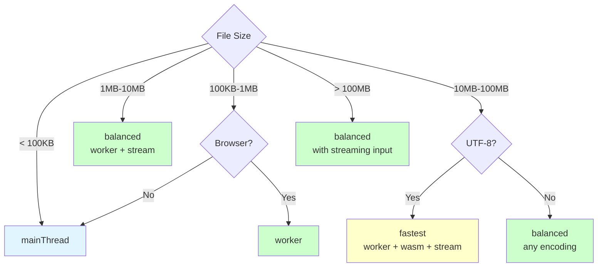

# Execution Strategies

This document explains how different execution strategies work and when to use each one.

> **Note for Bundler Users**: When using Worker-based strategies (worker, workerWasm, etc.) with bundlers like Vite or Webpack, you must explicitly specify the `workerURL` option. See [How to Use with Bundlers](../how-to-guides/using-with-bundlers.md) for details.

## Background

CSV parsing can be a performance bottleneck, especially when dealing with large files. The performance requirements vary significantly depending on the runtime environment:

**Browser Context:**
- **UI Responsiveness**: Parsing on the main thread occupies the thread, preventing user interactions and causing the UI to freeze
- **User Experience**: Users expect smooth, responsive applications even when processing large datasets
- **Memory Constraints**: Mobile devices and older hardware have limited memory

**Server Context (Node.js, Deno, Bun):**
- **Throughput**: Need to handle multiple concurrent requests efficiently
- **CPU Utilization**: Can leverage multiple cores for parallel processing
- **Memory Management**: Large files can exhaust server memory if not handled properly

web-csv-toolbox addresses these challenges through flexible execution strategies that work across all JavaScript runtimes.

## Overview

web-csv-toolbox supports multiple execution strategies that can be combined for optimal performance:

1. **Main Thread** - Traditional synchronous parsing
2. **Worker Threads** - Offload parsing to background threads
3. **WebAssembly** - High-performance WASM parsing
4. **Combined** - Worker + WASM for maximum performance

## Main Thread Execution

### How It Works

Parsing runs synchronously on the main thread (browser) or event loop (Node.js/Deno/Bun), occupying it and preventing other operations until completion.

- **In Browsers**: The main thread cannot respond to user interactions or update the UI while parsing
- **On Servers**: The event loop is occupied by CSV processing, reducing throughput for other requests

### Characteristics

**Advantages:**
- ✅ **Most stable**: Uses only standard JavaScript APIs
- ✅ No initialization overhead
- ✅ No worker communication overhead
- ✅ Simple and straightforward
- ✅ Works everywhere
- ✅ Supports WHATWG Encoding Standard encodings (via TextDecoder)
- ✅ Supports all quotation characters

**Disadvantages:**
- ❌ Occupies the main thread/event loop
- ❌ **Browser**: UI freezes during parsing
- ❌ **Server**: Reduces throughput for concurrent requests

### When to Use

- When stability is the highest priority
- Server-side processing where UI blocking is acceptable
- Quick scripts or prototypes
- When worker overhead is unacceptable
- When WHATWG Encoding Standard encodings support is needed

### Example

```typescript
import { parse } from 'web-csv-toolbox';

// Runs on main thread (default)
for await (const record of parse(csv)) {
  console.log(record);
}
```

---

## Worker Thread Execution

### How It Works


Parsing is offloaded to a separate worker thread, keeping the main thread free.

### Message Streaming Strategy

**How It Works:**


Records are sent one by one via [**postMessage**](https://developer.mozilla.org/docs/Web/API/Worker/postMessage) API.

**Characteristics:**
- ✅ **Stable**: Uses standard Web Workers API
- ✅ Works on all browsers (including Safari)
- ✅ Reliable and well-tested
- ⚠️ Worker communication adds overhead (data transfer between threads)
- ⚠️ Requires bundler configuration for worker URL

**Best For:**
- When Safari support is required
- When maximum compatibility is needed
- Non-blocking parsing with stable API

### Stream Transfer Strategy

**How It Works:**


The entire stream is transferred to the worker using Transferable Streams.

**Characteristics:**
- ⚠️ **Experimental**: Uses Transferable Streams API which is still evolving and may change
- ✅ Zero-copy transfer (very efficient)
- ✅ Constant memory usage
- ✅ Good for streaming workloads
- ✅ Automatic fallback to stable message-streaming on Safari
- ❌ Not supported on Safari (auto-falls back)

**Best For:**
- Streaming workloads
- Memory-sensitive applications
- Chrome, Firefox, Edge browsers (Safari will auto-fallback to message-streaming)
- When stable fallback is acceptable

### Runtime Support

For detailed information about supported environments and browser compatibility, see **[Supported Environments](../reference/supported-environments.md)**.

**Quick Summary:**
- ✅ **Node.js LTS**: Full support with Worker Threads
- ✅ **Deno LTS**: Full support with Web Workers
- ✅ **Chrome/Firefox/Edge**: Full support including Transferable Streams
- ⚠️ **Safari**: Supported with automatic fallback (no Transferable Streams)
- ⚠️ **Bun**: Community support (untested)

**Note:** Safari automatically falls back to message-streaming when Transferable Streams are not available. See [Automatic Fallback Behavior](#automatic-fallback-behavior) for details.

### Platform Differences

Worker execution works across different JavaScript runtimes with platform-specific implementations:

**Browser (Web Workers)**
```typescript
import { parseString, EnginePresets } from 'web-csv-toolbox';

for await (const record of parseString(csv, {
  engine: EnginePresets.balanced()
})) {
  console.log(record);
  // UI stays responsive!
}
```
- Runs in separate memory space for full isolation
- Worker initialization overhead exists
- Best for: UI-responsive web applications

**Node.js (Worker Threads)**
```typescript
import { parseString, EnginePresets } from 'web-csv-toolbox';

// Worker threads are used automatically
for await (const record of parseString(csv, {
  engine: EnginePresets.balanced()
})) {
  console.log(record);
}
```
- Uses `node:worker_threads` internally (Node.js LTS)
- Shared V8 instance for lower memory overhead
- Worker initialization overhead exists (lower than browser)
- Best for: Server-side concurrent processing

**Deno (Web Workers)**
- Uses standard Web Workers API
- Native TypeScript support
- Similar characteristics to browser workers
- Best for: Web standards-compatible server applications

For detailed platform specifications and compatibility information, see **[Supported Environments](../reference/supported-environments.md)**.

### Automatic Fallback Behavior

web-csv-toolbox automatically falls back to more compatible execution methods when the requested strategy is not available. This behavior is enabled by default but can be disabled with strict mode.

**Stream Transfer → Message Streaming:**
- Occurs when the browser doesn't support Transferable Streams (e.g., Safari)
- Automatically uses message-streaming without errors
- No code changes required

**Example (Default - with auto-fallback):**
```typescript
import { parseString, EnginePresets } from 'web-csv-toolbox';

// Request stream-transfer strategy
for await (const record of parseString(csv, {
  engine: EnginePresets.memoryEfficient()
})) {
  console.log(record);
}
// On Safari: Automatically falls back to message-streaming
// On Chrome/Firefox/Edge: Uses stream-transfer as requested
```

**Example (Strict mode - no fallback):**
```typescript
import { parseString } from 'web-csv-toolbox';

// Strict mode: throw error if stream-transfer not supported
for await (const record of parseString(csv, {
  engine: {
    worker: true,
    workerStrategy: 'stream-transfer',
    strict: true  // Disable automatic fallback
  }
})) {
  console.log(record);
}
// On Safari: Throws an error
// On Chrome/Firefox/Edge: Uses stream-transfer as requested
```

**When to use strict mode:**
- Testing/debugging to ensure specific strategy is used
- When you need to guarantee a specific execution method
- When you want to explicitly handle unsupported features

For more details on the `strict` option, refer to the [`EngineConfig`](https://kamiazya.github.io/web-csv-toolbox/interfaces/EngineConfig.html) type documentation in your IDE or the [API Reference](https://kamiazya.github.io/web-csv-toolbox/).

### When to Use Workers

✅ **Use workers when:**
- **Browser**: UI responsiveness is critical (non-blocking parsing required)
- **Server**: Processing multiple files concurrently
- **Server**: Spare CPU cores available for parallel processing
- Need stable non-blocking execution (`worker` preset)
- Accept experimental API with stable fallback (`balanced` preset)

❌ **Skip workers when:**
- **Stability is highest priority**: Use `mainThread` preset instead
- Worker initialization overhead is unacceptable for your use case
- Simple scripts or command-line tools
- Very tight latency requirements
- Server-side where UI blocking is acceptable

### Example

**Browser (UI responsiveness):**
```typescript
import { parse, EnginePresets } from 'web-csv-toolbox';

// Worker with message streaming (Safari compatible)
for await (const record of parse(csv, {
  engine: EnginePresets.responsive()
})) {
  console.log(record);
  // UI stays responsive!
}

// Worker with stream transfer (best for Chrome/Firefox/Edge)
for await (const record of parse(response, {
  engine: EnginePresets.memoryEfficient()
})) {
  console.log(record);
  // Zero-copy streaming!
}
```

**Server (concurrent processing):**
```typescript
import { parseStringStream, ReusableWorkerPool } from 'web-csv-toolbox';
import { createReadStream } from 'node:fs';
import { Readable } from 'node:stream';

// Create worker pool for handling multiple files
using pool = new ReusableWorkerPool({ maxWorkers: 4 });

// Process multiple CSV files concurrently with streaming
await Promise.all(
  csvFiles.map(async (filePath) => {
    // Stream file from disk
    const fileStream = createReadStream(filePath, 'utf-8');
    const webStream = Readable.toWeb(fileStream);

    let processedCount = 0;
    for await (const record of parseStringStream(webStream, {
      engine: { worker: true, workerPool: pool }
    })) {
      // Process each record without loading all into memory
      await processRecord(record);  // e.g., insert to database
      processedCount++;
    }

    console.log(`Processed ${processedCount} records from ${filePath}`);
  })
);

async function processRecord(record) {
  // Process individual record (e.g., database insert, validation, etc.)
  // Records are not accumulated in memory
}
```

---

## WebAssembly Execution

### How It Works

Parsing uses pre-compiled WebAssembly code for improved performance compared to JavaScript.

- **In Browsers**: Generally faster than JavaScript, but still occupies the main thread
- **On Servers**: Potentially faster parsing with lower CPU usage, but still occupies the event loop

**Performance Note:** Actual performance improvements vary depending on data size, content complexity, and runtime environment. In many cases, WASM can provide significant speedups, but results may differ based on your specific use case.

### Why WASM is Faster

**JavaScript:**
```javascript
// Interpreted/JIT compiled at runtime
function parseCSV(text) {
  // Character-by-character processing
  for (let i = 0; i < text.length; i++) {
    const char = text[i];
    // ... complex logic ...
  }
}
```

**WebAssembly:**
```wasm
;; Pre-compiled to machine code
(func $parse_csv
  ;; Optimized low-level operations
  ;; Direct memory access
  ;; Efficient memory operations
)
```

**Performance Characteristics:**
- Generally faster parsing (actual speedup varies by workload)
- Lower CPU usage in many scenarios
- More efficient memory access
- Performance depends on data size, complexity, and runtime

### Characteristics

**Advantages:**
- ✅ Generally faster than JavaScript (speedup varies by workload)
- ✅ Lower CPU usage in many scenarios
- ✅ Predictable performance characteristics
- ✅ Small binary size (~82KB WASM module)

**Disadvantages:**
- ❌ UTF-8 encoding only
- ❌ Double-quote (`"`) only
- ❌ Still occupies main thread/event loop
- ⚠️ First-time initialization can be a bottleneck (recommended to call `loadWASM()` beforehand)

### Limitations

#### UTF-8 Only

```typescript
// ✅ Works
parse(utf8CSV, { engine: { wasm: true } });

// ❌ Won't work
parse(shiftJISCSV, {
  charset: 'shift-jis',
  engine: { wasm: true }
});
```

#### Double-Quote Only

```typescript
// ✅ Works
parse('a,"b,c",d', { engine: { wasm: true } });

// ❌ Won't work
parse("a,'b,c',d", {
  quotation: "'",
  engine: { wasm: true }
});
```

### When to Use WASM

✅ **Use WASM when:**
- Files are UTF-8 encoded
- Using standard CSV format (double-quotes)
- Performance is critical
- **Browser**: CPU usage matters (battery-powered devices, mobile)
- **Server**: High-throughput parsing with lower CPU overhead

❌ **Skip WASM when:**
- Non-UTF-8 encoding (e.g., Shift-JIS, EUC-JP)
- Custom quotation characters
- Broad format support needed
- First-time initialization latency is critical (unless you pre-load with `loadWASM()`)

### Example

**Recommended: Pre-load WASM for better performance**
```typescript
import { parse, EnginePresets, loadWASM } from 'web-csv-toolbox';

// Recommended: Load WASM module once at startup
// This prevents initialization overhead on first parse
await loadWASM();

// Parse with WASM
for await (const record of parse(csv, {
  engine: EnginePresets.fast()
})) {
  console.log(record);
}
```

**Alternative: Automatic initialization (slower on first use)**
```typescript
import { parse, EnginePresets } from 'web-csv-toolbox';

// WASM is automatically initialized on first use
// However, this can cause a noticeable delay on the first parse
for await (const record of parse(csv, {
  engine: EnginePresets.fast()
})) {
  console.log(record);
}
```

**Note:** The first WASM parse without pre-loading can take longer due to module initialization. Pre-loading with `loadWASM()` is recommended to avoid this bottleneck, especially in performance-critical applications.

---

## Combined: Worker + WASM

### How It Works

**In Browsers:**


**On Servers:**


Combines the benefits of both strategies:
- Worker offloading (keeps main thread/event loop free)
- WASM acceleration (generally faster parsing, varies by workload)

### Characteristics

**Advantages:**
- ✅ Generally faster than JavaScript (speedup varies by workload)
- ✅ **Browser**: Non-blocking UI, smooth user experience
- ✅ **Server**: High throughput, can handle concurrent requests
- ✅ Best overall performance in many scenarios
- ✅ Good for large files

**Disadvantages:**
- ❌ UTF-8 encoding only
- ❌ Double-quote (`"`) only
- ❌ Worker + WASM initialization overhead
- ⚠️ First-time WASM initialization can be a bottleneck (recommended to call `loadWASM()` beforehand)

### When to Use Combined

✅ **Use combined when:**
- Large UTF-8 files (> 10MB)
- **Browser**: UI responsiveness + performance both critical
- **Server**: High-throughput processing with concurrent requests
- Standard CSV format (UTF-8, double-quotes)

❌ **Skip combined when:**
- Non-UTF-8 encoding required
- File size < 1MB (overhead not worth it)
- Maximum compatibility needed
- Simple single-file processing

### Example

**Recommended: Pre-load WASM for better performance**
```typescript
import { parse, EnginePresets, loadWASM } from 'web-csv-toolbox';

// Recommended: Load WASM module once at startup
await loadWASM();

// Best of both worlds: Worker + WASM + stream-transfer
for await (const record of parse(csv, {
  engine: EnginePresets.responsiveFast()
})) {
  console.log(record);
  // Fast + non-blocking!
}
```

**Alternative: Automatic initialization (slower on first use)**
```typescript
import { parse, EnginePresets } from 'web-csv-toolbox';

// WASM is automatically initialized on first use
// However, this can cause a delay on the first parse
for await (const record of parse(csv, {
  engine: EnginePresets.responsiveFast()
})) {
  console.log(record);
}
```

---

## Performance Comparison

### General Characteristics

Performance varies significantly based on:
- **Data size**: Larger files benefit more from optimization
- **Content complexity**: Simple vs. quoted/escaped content
- **Runtime environment**: Browser, Node.js, Deno, Bun
- **Hardware**: CPU architecture, available memory

| Strategy | Parse Time | Main Thread/Event Loop | Memory | CPU Usage |
|----------|-----------|------------------------|--------|-----------|
| Main Thread | Baseline | ❌ Occupied | Moderate | Higher |
| Worker (message) | Baseline + overhead | ✅ Free | Moderate | Higher |
| Worker (stream) | Baseline + overhead | ✅ Free | Lower | Higher |
| WASM | Generally faster | ❌ Occupied | Lower | Lower |
| Worker + WASM | Generally faster + overhead | ✅ Free | Moderate | Lower |

**Key Insights:**
- WASM generally provides faster parsing (actual speedup varies)
- Worker has initialization overhead but keeps main thread responsive
- Stream transfer is more memory efficient than message passing
- Worker + WASM combines benefits of parallelization and optimization
- Performance improvements depend on your specific workload

**Note:** For measured performance data on specific workloads, see [CodSpeed benchmarks](https://codspeed.io/kamiazya/web-csv-toolbox). Always benchmark with your actual data to determine the best strategy for your use case.

### Memory Characteristics

#### Main Thread / WASM
```
Memory: O(n) - proportional to file size
```

#### Worker (Message Streaming)
```
Memory: O(n) + overhead for message copies
```

#### Worker (Stream Transfer)
```
Memory: O(1) - constant per record (streaming)
```

---

## Decision Guide

### By File Size



### By Requirements

**Browser - Need UI responsiveness?**
→ Use worker (`balanced`, `worker`, `fastest`)

**Server - Need high throughput?**
→ Use worker with pool (`balanced`, `fastest`)

**Need maximum speed?**
→ Use WASM (`wasm`, `fastest`)

**Need broad format support (non-UTF-8, custom quotes)?**
→ Avoid WASM (`balanced`, `worker`, `mainThread`)

**Browser - Safari support required?**
→ Use message-streaming (`worker`, not `workerStreamTransfer`)

**Need maximum compatibility?**
→ Use `mainThread` (works everywhere)

### By Environment

**Browser (UI-critical):**
→ `balanced` or `fastest` (keep UI responsive)

**Node.js/Deno/Bun (server-side):**
→ `balanced` with `WorkerPool` (concurrent processing)

**Safari:**
→ `worker` or `balanced` (auto-fallback to message-streaming)

**Chrome/Firefox/Edge:**
→ `fastest` or `workerStreamTransfer` (zero-copy streams)

**CLI tools / Scripts:**
→ `mainThread` or `wasm` (no worker overhead)

---

## Related Documentation

- **[Engine Presets](../reference/engine-presets.md)** - Pre-configured settings
- **[Supported Environments](../reference/supported-environments.md)** - Runtime compatibility and support levels
- **[Versioning Policy](../reference/versioning-policy.md)** - Version management and stability guarantees
- **[How-To: Optimize Performance](../how-to-guides/optimize-performance.md)** - Performance tips

For advanced configuration options, refer to the [`EngineConfig`](https://kamiazya.github.io/web-csv-toolbox/interfaces/EngineConfig.html) type documentation in your IDE or the [API Reference](https://kamiazya.github.io/web-csv-toolbox/).
